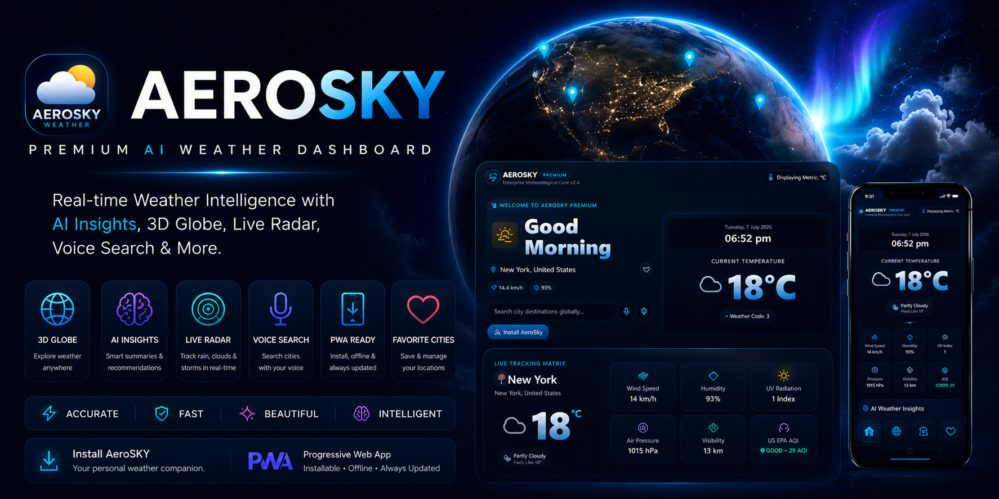

<div align="center">

<!-- PLACEHOLDER: Replace with a real hero banner image (1280x640 recommended) -->


<br />

# 🌌 AeroSky

### Premium AI Weather Dashboard

A full-stack, installable weather Progressive Web App combining real-time meteorological data, AI-driven insights, an interactive 3D globe, live radar, and a glassmorphic UI — built for speed, polish, and delight.

<br />

<!-- BADGES -->
[](https://react.dev/)
[](https://vitejs.dev/)
[](https://nodejs.org/)
[](https://expressjs.com/)
[](https://tailwindcss.com/)
[](https://web.dev/progressive-web-apps/)
[](#-license)

<br />

<!-- PLACEHOLDER: Replace with real deployed links -->
[**🌐 Live Demo**](https://your-deployment-url.vercel.app) · [**📦 Repository**](https://github.com/your-username/aerosky) · [**🐛 Report a Bug**](https://github.com/your-username/aerosky/issues) · [**✨ Request a Feature**](https://github.com/your-username/aerosky/issues)

</div>

<br />

---

## 📸 Screenshots

<div align="center">

| Dashboard (Desktop) | Dashboard (Mobile) |
|:---:|:---:|
| <!-- PLACEHOLDER -->  | <!-- PLACEHOLDER -->  |

| AI Weather Insights | Interactive 3D Globe |
|:---:|:---:|
| <!-- PLACEHOLDER -->  | <!-- PLACEHOLDER -->  |

| Dynamic Weather Backgrounds | PWA Install Experience |
|:---:|:---:|
| <!-- PLACEHOLDER -->  | <!-- PLACEHOLDER -->  |

| Voice Search | Live Weather Radar |
|:---:|:---:|
| <!-- PLACEHOLDER -->  | <!-- PLACEHOLDER -->  |

</div>

<br />

<div align="center">

### 🎬 See it in action

<!-- PLACEHOLDER: Replace with a real demo GIF or embedded video link -->


</div>

<br />

---

## 📋 Table of Contents

- [About AeroSky](#-about-aerosky)
- [Features](#-features)
- [Technology Stack](#-technology-stack)
- [Folder Structure](#-folder-structure)
- [Installation Guide](#-installation-guide)
- [Environment Variables](#-environment-variables)
- [API Information](#-api-information)
- [Architecture](#-architecture)
- [Performance Optimizations](#-performance-optimizations)
- [Progressive Web App](#-progressive-web-app)
- [Responsive Design](#-responsive-design)
- [Challenges & Learnings](#-challenges--learnings)
- [Future Improvements](#-future-improvements)
- [Contributing](#-contributing)
- [License](#-license)
- [Author](#-author)
- [Acknowledgements](#-acknowledgements)

<br />

---

## 🌤️ About AeroSky

AeroSky is a modern, full-stack weather dashboard designed to go far beyond the typical weather widget. Most weather apps stop at "temperature and a forecast" — AeroSky treats weather as an experience, pairing accurate, real-time meteorological data with a genuinely premium interface: glassmorphic cards, fluid motion design, a fully interactive 3D globe for exploring cities anywhere on Earth, live precipitation radar, and AI-generated insights that translate raw numbers into plain-language guidance.

It's built as an installable Progressive Web App, meaning it behaves like a native application — installable to a home screen, resilient to flaky connections, and quick to launch — while still being a single, standards-based web codebase.

The project was built with a strong focus on:

- **Performance** — aggressive backend caching, response compression, and rate limiting to keep the app fast and resilient under real-world network conditions.
- **User experience** — every interaction, from searching a city to rotating the globe, is designed to feel deliberate and smooth rather than default/off-the-shelf.
- **Clean architecture** — a decoupled frontend/backend split, with the backend acting as a resilient orchestration layer over third-party weather APIs rather than a thin proxy.
- **Scalability** — component-driven frontend architecture and a service-layer backend designed to make adding new data sources or features straightforward.

<br />

---

## ✨ Features

### 🌦️ Weather Data

| Feature | Description |
|---|---|
| Real-time weather | Live current conditions for any searched location |
| Hourly forecast | Rolling 24-hour forecast with interactive charts |
| Multi-day forecast | Extended daily outlook with highs, lows, and conditions |
| Feels Like Temperature | Apparent temperature accounting for wind & humidity |
| Humidity | Current relative humidity percentage |
| Wind Speed & Direction | Real-time wind speed with directional data |
| Pressure | Surface atmospheric pressure |
| Visibility | Current visibility distance |
| UV Index | Real-time UV exposure index |
| Dew Point | Current dew point temperature |
| Cloud Coverage | Percentage of sky covered by cloud |
| Sunrise / Sunset | Daily sunrise and sunset times |
| Air Quality Index (AQI) | US EPA air quality index with pollutant breakdown |

### 🔍 Search & Discovery

| Feature | Description |
|---|---|
| Global city search | Debounced, type-ahead city search worldwide |
| GPS location | One-tap "use my current location" via browser geolocation |
| Voice search | Search by speaking a city name aloud |
| Favorite cities | Save and quickly revisit favorite locations |
| Quick city switching | Instantly swap the active dashboard city |

### 🎨 Premium UI

| Feature | Description |
|---|---|
| Glassmorphism | Frosted-glass card design system throughout |
| Responsive design | Fully adaptive across desktop, tablet, and mobile |
| Mobile friendly | Touch-optimized interactions and layout |
| Premium dashboard | Cohesive, dashboard-style information architecture |
| Beautiful cards | Consistent, polished card components across all sections |
| Smooth animations | Motion-driven transitions powered by Framer Motion |
| Live clock | Real-time clock reflecting the selected location |
| Dynamic greeting | Time-of-day-aware greeting with animated iconography |

### 🌈 Dynamic Weather Experience

| Feature | Description |
|---|---|
| Sunny background | Animated clear-sky ambient background |
| Cloudy background | Drifting cloud ambient background |
| Rain animation | Falling rain particle animation |
| Snow animation | Falling snow particle animation |
| Fog animation | Atmospheric fog/haze effect |
| Thunderstorm animation | Lightning and storm ambient effects |

The active background is chosen dynamically based on the live weather code of the selected city — the entire visual atmosphere of the app changes with the weather.

### 🌍 Visualization

| Feature | Description |
|---|---|
| Interactive 3D Globe | A fully rendered, rotatable Earth with day/night textures, cloud layer, and atmospheric glow |
| City markers | Animated markers for major world cities, expandable via search |
| Camera choreography | Smooth quaternion-based rotation and cinematic camera dolly on city selection |
| Live weather radar | Real-time precipitation and cloud radar overlay with timeline scrubbing and fullscreen support |

### 🤖 AI

| Feature | Description |
|---|---|
| AI Weather Insights | Plain-language, context-aware summaries generated from live conditions |
| Smart recommendations | Actionable suggestions (hydration, sunscreen, umbrellas, etc.) based on real thresholds |
| Intelligent weather summary | Multi-factor analysis combining temperature, precipitation, wind, humidity, and UV |

### 📲 Progressive Web App

| Feature | Description |
|---|---|
| Installable | Add to home screen on both mobile and desktop |
| Offline support | Core experience remains available without a live connection |
| Auto update | New versions are picked up automatically |
| Native install button | Custom in-app install prompt, not just the browser default |
| Service worker | Handles caching and offline resilience |

### ⚡ Performance

| Feature | Description |
|---|---|
| Backend caching | In-memory caching layer to minimize redundant upstream API calls |
| Compression | Gzip response compression across the API |
| API optimization | Parallelized upstream requests with graceful partial-failure handling |
| Rate limiting | Protects the backend from abuse and accidental overuse |
| Optimized API calls | Debounced search, cached weather payloads, minimal re-fetching |

<br />

---

## 🛠️ Technology Stack

### Frontend

| Technology | Purpose |
|---|---|
| [React](https://react.dev/) | Core UI library |
| [Vite](https://vitejs.dev/) | Build tool & dev server |
| [Tailwind CSS](https://tailwindcss.com/) | Utility-first styling |
| [Framer Motion](https://www.framer.com/motion/) | Animation & motion design |
| React Context API | Global state management |
| [Axios](https://axios-http.com/) | HTTP client |

### Backend

| Technology | Purpose |
|---|---|
| [Node.js](https://nodejs.org/) | JavaScript runtime |
| [Express.js](https://expressjs.com/) | Web application framework |

### Supporting Libraries

| Library | Purpose |
|---|---|
| Lucide React | Icon system |
| Node Cache | In-memory backend caching |
| Helmet | HTTP security headers |
| Morgan | Development request logging |
| Compression | Gzip response compression |
| Express Rate Limit | API rate limiting |
| CORS | Cross-origin request handling |
| vite-plugin-pwa | Progressive Web App tooling |

### APIs & Browser Platform Features

| Source | Purpose |
|---|---|
| [Open-Meteo Weather API](https://open-meteo.com/) | Core weather forecast data |
| [Open-Meteo Air Quality API](https://open-meteo.com/en/docs/air-quality-api) | Air quality index data |
| Browser Geolocation API | Current-location weather |
| Web Speech API | Voice search |

### Deployment

| Layer | Platform |
|---|---|
| Frontend | [Vercel](https://vercel.com/) |
| Backend | [Vercel](https://vercel.com/) |

<br />

---

## 📁 Folder Structure

<!-- This reflects the actual project layout. Update if the structure changes. -->

```
aerosky/
│
├── backend/
│   ├── cache/
│   │   └── nodeCache.js              # In-memory cache implementation
│   ├── config/
│   │   └── corsOptions.js            # CORS configuration
│   ├── controllers/
│   │   └── weatherController.js      # Request handling for weather routes
│   ├── middleware/
│   │   ├── errorHandler.js           # Centralized error handling
│   │   ├── rateLimiter.js            # API rate limiting
│   │   └── requestLogger.js          # Structured request logging
│   ├── routes/
│   │   ├── weatherRoutes.js          # /api/weather/* endpoints
│   │   └── locationRoutes.js         # /api/location/* endpoints
│   ├── services/
│   │   ├── openMeteoService.js       # Open-Meteo integration & orchestration
│   │   └── geocodeService.js         # City search & reverse geocoding
│   ├── utils/
│   │   └── logger.js                 # Application logger
│   ├── .env                          # Backend environment variables
│   ├── server.js                     # Express app entry point
│   ├── vercel.json                   # Vercel deployment config
│   └── package.json
│
├── frontend/
│   ├── public/
│   │   ├── icon-192.png              # PWA icon
│   │   ├── icon-512.png              # PWA icon
│   │   └── favicon.ico
│   │
│   ├── src/
│   │   ├── assets/
│   │   │   └── earth/                # Globe textures (day/night/clouds/normal/specular maps)
│   │   │
│   │   ├── components/
│   │   │   ├── pwa/
│   │   │   │   └── InstallButton.jsx # Custom PWA install button
│   │   │   ├── radar/
│   │   │   │   ├── RadarSection.jsx  # Globe ↔ Radar tab container
│   │   │   │   ├── RadarMap.jsx      # Leaflet map + RainViewer overlay logic
│   │   │   │   ├── RadarControls.jsx # Layer switcher, locate-me, fullscreen
│   │   │   │   ├── RadarLegend.jsx   # Color intensity legend
│   │   │   │   └── RadarTimeline.jsx # Past/forecast frame scrubber
│   │   │   ├── AIWeatherInsights.jsx # AI-generated insight cards
│   │   │   ├── AnimatedNumber.jsx    # Spring-animated numeric counter
│   │   │   ├── ChartTabs.jsx         # Analytics chart tab switcher
│   │   │   ├── CurrentWeather.jsx    # Primary current-conditions card
│   │   │   ├── DailyForecast.jsx     # Multi-day forecast list
│   │   │   ├── FavoriteButton.jsx    # Reusable heart/favorite toggle
│   │   │   ├── FavoriteCities.jsx    # Saved favorite cities grid
│   │   │   ├── Footer.jsx            # App footer
│   │   │   ├── HeroSection.jsx       # Landing hero with greeting & search
│   │   │   ├── HourlyForecast.jsx    # 24-hour forecast strip
│   │   │   ├── LiveClock.jsx         # Real-time location clock
│   │   │   ├── RippleButton.jsx      # Reusable ripple/tap-feedback button
│   │   │   ├── SearchBar.jsx         # Global city search with dropdown
│   │   │   ├── VoiceSearchButton.jsx # Voice-driven city search
│   │   │   ├── WeatherAlerts.jsx     # Threshold-based weather alerts
│   │   │   ├── WeatherAnalytics.jsx  # Multi-metric interactive charts
│   │   │   ├── WeatherBackground.jsx # Dynamic weather-based background router
│   │   │   └── WeatherEffects.jsx    # Ambient particle/effect layer
│   │   │
│   │   ├── context/
│   │   │   └── WeatherContext.jsx    # Global weather/app state (Context API)
│   │   │
│   │   ├── globe/
│   │   │   ├── CameraController.jsx  # Camera distance/dolly animation
│   │   │   ├── Earth.jsx             # Earth mesh, textures & atmosphere shader
│   │   │   ├── GlobeControls.js      # Shared rotation target state
│   │   │   ├── GlobeGroup.jsx        # Earth + markers rotation group
│   │   │   ├── GlobeScene.jsx        # React Three Fiber canvas & lighting
│   │   │   ├── GlobeSection.jsx      # Globe container component
│   │   │   ├── Marker.jsx            # Interactive city marker
│   │   │   └── utils.js              # Lat/lon ↔ 3D vector & quaternion math
│   │   │
│   │   ├── hooks/                    # Custom React hooks
│   │   ├── layouts/                  # Layout wrapper components
│   │   ├── pages/                    # Page-level components
│   │   │
│   │   ├── pwa/
│   │   │   └── usePWAInstall.js      # PWA install-prompt hook
│   │   │
│   │   ├── services/
│   │   │   └── api.js                # Axios client & API request functions
│   │   │
│   │   ├── styles/                   # Global styles
│   │   │
│   │   ├── utils/
│   │   │   └── favorites.js          # Favorite cities persistence (localStorage)
│   │   │
│   │   ├── weather/
│   │   │   ├── SunnyBackground.jsx
│   │   │   ├── CloudyBackground.jsx
│   │   │   ├── RainBackground.jsx
│   │   │   ├── SnowBackground.jsx
│   │   │   ├── FogBackground.jsx
│   │   │   └── ThunderBackground.jsx
│   │   │
│   │   ├── App.jsx                   # Root application component
│   │   ├── main.jsx                  # Application entry point
│   │   └── service-worker.js         # PWA service worker
│   │
│   ├── .env                          # Frontend environment variables
│   ├── index.html
│   ├── package.json
│   ├── postcss.config.js
│   ├── tailwind.config.js
│   └── vite.config.js
│
├── .gitignore
├── package.json
└── README.md
```

<br />

---

## 🚀 Installation Guide

### Prerequisites

- [Node.js](https://nodejs.org/) v18 or higher
- npm (comes bundled with Node.js)
- Git

### 1. Clone the repository

```bash
git clone https://github.com/your-username/aerosky.git
cd aerosky
```

### 2. Install dependencies

**Backend:**

```bash
cd backend
npm install
```

**Frontend:**

```bash
cd frontend
npm install
```

### 3. Configure environment variables

Set up the `.env` files as described in the [Environment Variables](#-environment-variables) section below.

### 4. Run the backend

```bash
cd backend
npm run dev
```

The backend will start on `http://localhost:5000` by default.

### 5. Run the frontend

```bash
cd frontend
npm run dev
```

The frontend will start on `http://localhost:5173` by default.

### 6. Open the app

Navigate to `http://localhost:5173` in your browser.

<br />

---

## 🔑 Environment Variables

### Backend (`backend/.env`)

```env
PORT=5000
NODE_ENV=development

# Base URL for the Open-Meteo forecast API
OPEN_METEO_BASE_URL=https://api.open-meteo.com/v1

# Add any additional backend secrets/keys below
# EXAMPLE_API_KEY=your_key_here
```

### Frontend (`frontend/.env`)

```env
# Base URL of your backend API
VITE_API_URL=http://localhost:5000
```

> ⚠️ **Note:** For local development, point `VITE_API_URL` at your local backend (`http://localhost:5000`). For production, set this to your deployed backend URL in your hosting provider's environment variable settings — never commit production values to source control.

<br />

---

## 🌐 API Information

AeroSky is powered by the following external APIs and browser platform features:

| API / Feature | Usage in AeroSky |
|---|---|
| [Open-Meteo Weather API](https://open-meteo.com/en/docs) | Current conditions, hourly forecast, and daily forecast data |
| [Open-Meteo Air Quality API](https://open-meteo.com/en/docs/air-quality-api) | Real-time Air Quality Index (AQI) and pollutant levels |
| [RainViewer API](https://www.rainviewer.com/api.html) | Live precipitation radar and satellite cloud tile overlays |
| Browser Geolocation API | Retrieves the user's current coordinates for "use my location" |
| Web Speech API | Powers voice-driven city search |

> ℹ️ Open-Meteo's public weather and air quality endpoints do not require an API key for non-commercial use. <!-- PLACEHOLDER: update this note if you migrate to a paid/keyed tier or add additional providers -->

<br />

---

## 🏗️ Architecture

<!-- PLACEHOLDER: Insert a real architecture diagram here (e.g. exported from Excalidraw, draw.io, or Figma) -->

```
docs/assets/architecture-diagram.png
```

At a high level:

```
┌──────────────┐        HTTPS         ┌──────────────┐        HTTPS         ┌────────────────────┐
│              │ ───────────────────> │              │ ───────────────────> │  Open-Meteo APIs    │
│   Frontend    │                     │   Backend     │                     │  (Weather + AQI)     │
│  (React/Vite) │ <─────────────────── │ (Node/Express)│ <─────────────────── │  RainViewer API     │
│              │      JSON payload    │              │      JSON payload    └────────────────────┘
└──────────────┘                      └──────────────┘
```

The frontend never calls third-party weather providers directly — all upstream requests are orchestrated through the backend, which handles caching, retries, and response shaping before returning a clean, consistent payload to the client.

<br />

---

## ⚡ Performance Optimizations

AeroSky is engineered with several layers of performance-conscious design:

- **Backend caching** — Weather responses are cached in-memory (via `node-cache`) keyed by coordinates, dramatically reducing redundant upstream API calls for frequently requested locations.
- **Compression** — All API responses are gzip-compressed via `compression` middleware, reducing payload size over the wire.
- **Rate limiting** — `express-rate-limit` protects backend endpoints from abuse and accidental request storms.
- **Optimized API calls** — Search input is debounced client-side, upstream weather + air quality requests are parallelized rather than sequential, and partial-failure handling ensures one slow/failing upstream call doesn't block the entire dashboard from loading.
- **Lazy rendering** — Sections reveal progressively as the user scrolls, rather than rendering the entire dashboard eagerly on load.
- **PWA caching** — The service worker caches static assets, reducing load times on repeat visits.

<br />

---

## 📲 Progressive Web App

AeroSky is a fully installable Progressive Web App:

- **Installable** — Users can install AeroSky directly to their device's home screen or desktop, via a custom in-app install prompt or the browser's native install option.
- **Offline support** — A service worker caches core assets so the app remains usable even with an unreliable or absent connection.
- **Auto updates** — New deployments are automatically detected and applied without requiring a manual reinstall.
- **Native experience** — Once installed, AeroSky runs in standalone display mode, indistinguishable at a glance from a natively installed application.

<br />

---

## 📱 Responsive Design

AeroSky is designed mobile-first and rigorously tested across breakpoints:

| Device | Experience |
|---|---|
| 🖥️ Desktop | Full multi-section dashboard layout with expanded charts and globe |
| 📱 Tablet | Adaptive grid reflow preserving readability and touch targets |
| 📱 Mobile | Single-column stacked layout, touch-optimized controls, and simplified navigation |

<br />

---

## 🧠 Challenges & Learnings

Building AeroSky involved solving a number of real engineering problems beyond typical CRUD-style development:

<details>
<summary><strong>CORS Configuration</strong></summary>
<br />
Coordinating a separately deployed frontend and backend required carefully scoped CORS configuration to allow legitimate cross-origin requests from the deployed frontend domain while avoiding overly permissive wildcard policies.
</details>

<details>
<summary><strong>Backend API Architecture</strong></summary>
<br />
Rather than having the frontend call third-party weather APIs directly, a dedicated backend service layer was built to orchestrate, cache, and normalize responses from multiple upstream providers (forecast data and air quality data) into a single consistent payload.
</details>

<details>
<summary><strong>Caching Strategy</strong></summary>
<br />
An in-memory caching layer was introduced to avoid redundant calls to upstream weather APIs for frequently requested coordinates, improving response times and reducing the risk of upstream rate limiting.
</details>

<details>
<summary><strong>Performance Optimization Under Serverless Constraints</strong></summary>
<br />
Deploying the backend as a serverless function surfaced real-world networking behavior that doesn't show up in local development — including upstream request timeouts and inconsistent latency from cloud infrastructure IP ranges. This was addressed with explicit request timeouts, retry logic, and resilient partial-failure handling so a single slow upstream call can't take down the entire response.
</details>

<details>
<summary><strong>Responsive Design</strong></summary>
<br />
Building a dashboard with dense, information-rich cards (charts, globes, radar maps) that still feels natural on a small mobile screen required deliberate layout decisions — including moving away from mismatched-height multi-column grids in favor of predictable, stacked layouts.
</details>

<details>
<summary><strong>Progressive Web App Implementation</strong></summary>
<br />
Making the app genuinely installable and offline-resilient required correctly configuring a web app manifest, service worker, and custom install-prompt handling — including platform differences between Android and iOS install flows.
</details>

<details>
<summary><strong>Weather-Driven Animations</strong></summary>
<br />
Rendering smooth, full-screen particle-based weather animations (rain, snow, fog, thunderstorms) that remain performant across a wide range of devices and screen sizes required careful use of viewport-relative positioning rather than fixed pixel values.
</details>

<details>
<summary><strong>Voice Search Integration</strong></summary>
<br />
Integrating the Web Speech API required parsing natural, imprecise spoken phrases into clean search queries, along with graceful handling of unsupported browsers and speech recognition failure states.
</details>

<details>
<summary><strong>3D Globe Rotation Accuracy</strong></summary>
<br />
Rotating a 3D globe to precisely face an arbitrary city on click required moving from naive independent-axis Euler rotation (which breaks down away from the equator/reference meridian) to a proper quaternion-based rotation system for mathematically reliable results at any latitude and longitude.
</details>

<details>
<summary><strong>Favorite Cities Storage</strong></summary>
<br />
Favorite cities are persisted client-side, allowing users to retain their saved locations across sessions without requiring a backend user account system.
</details>

<br />

---

## 🗺️ Future Improvements

- [ ] Wind & temperature radar overlays
- [ ] Push notifications for severe weather alerts
- [ ] Historical weather data & trends
- [ ] Home screen weather widgets
- [ ] Expanded AI-driven recommendations
- [ ] User accounts & authentication
- [ ] Cloud-synced favorites across devices
- [ ] City comparison view
- [ ] Shareable weather cards (image export)
- [ ] Keyboard shortcuts (e.g. `Ctrl + K` to search)

<br />

---

## 🤝 Contributing

Contributions are welcome and appreciated! To contribute:

1. **Fork** the repository
2. **Create a new branch**
   ```bash
   git checkout -b feature/your-feature-name
   ```
3. **Make your changes** and commit them
   ```bash
   git commit -m "Add: your feature description"
   ```
4. **Push to your fork**
   ```bash
   git push origin feature/your-feature-name
   ```
5. **Open a Pull Request** describing your changes

Please ensure your code follows the existing style conventions and includes clear commit messages. For significant changes, consider opening an issue first to discuss what you'd like to change.

<br />

---

## 📄 License

<!-- PLACEHOLDER: Add your chosen license. Example below assumes MIT. -->

This project is licensed under the **MIT License** — see the [LICENSE](./LICENSE) file for details.

<br />

---

## 👤 Author

<!-- PLACEHOLDER: Replace with your actual details -->

**Pavan Kumar**

- GitHub: [pavan55kumar](https://github.com/pavan55kumar)
- LinkedIn: [Pavan Kumar](https://www.linkedin.com/in/pavan-kumar-6864b2320/)
- Portfolio: [portfolio-url](https://projectportfolio-blond.vercel.app/)
- Email: pavankumar.eng29@gmai.com

<br />

---

## 🙏 Acknowledgements

AeroSky wouldn't be possible without these excellent open-source projects and services:

- [Open-Meteo](https://open-meteo.com/) — free, open-source weather and air quality API
- [RainViewer](https://www.rainviewer.com/) — free radar and satellite tile data
- [React](https://react.dev/) — the UI library powering the entire frontend
- [Vercel](https://vercel.com/) — hosting and deployment platform
- [Tailwind CSS](https://tailwindcss.com/) — utility-first CSS framework
- [Express.js](https://expressjs.com/) — backend web framework
- [Node.js](https://nodejs.org/) — JavaScript runtime

<br />

<div align="center">

**If you found this project interesting, consider giving it a ⭐ on GitHub!**

</div>
